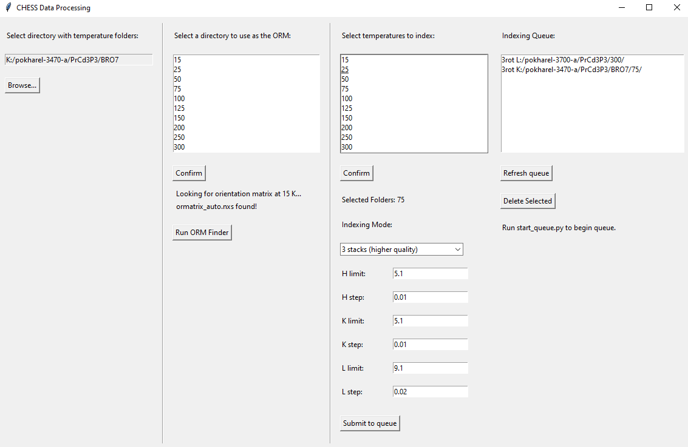

# ucsb-chess-processing

This repository contains a working version of the code used by the Wilson Lab at UCSB (adapted from Jacob P. C. Ruff at the Cornell High Energy Synchrotron Source), featuring a GUI for orienting and indexing stacked X-ray data from the QM2 beamline at CHESS. To run the GUI from the command line, use:

```
  > python tkinter_chess_queue.py
```

A separate script is used to watch the queue stored in the job file for commands, which can be run using:

```
  > python start_queue.py
```


